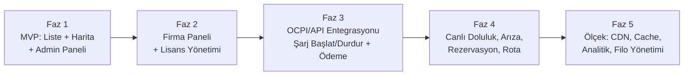

# ⚡ Voltavia — Proje Yol Haritası

> Bu doküman, `elektrikli_arac_sarj_platformu_proje_plani.docx` içeriğine dayanılarak
> hazırlanmıştır. Amaç: Türkiye'deki EV şarj istasyonlarını tek uygulamada toplamak,
> operatörlerle entegre olup tek uygulamadan şarj başlatma/ödeme akışı sunmak.
> Gelir modeli kullanıcıdan komisyon değil, **operatörlere satılan platform/entegrasyon
> lisansıdır.**

---

## 0. Vizyon Özeti

| Bileşen | Karar |
|---|---|
| Mobil uygulama | Flutter + Dart (iOS + Android tek kod tabanı) |
| Admin paneli | HTML + CSS + Vanilla JavaScript |
| Firma (operatör) paneli | HTML + CSS + Vanilla JavaScript |
| Backend / API | Cloudflare Workers (ihtiyaç oldukça TypeScript servisleri) |
| Ana veri tabanı | Firebase Firestore (NoSQL) |
| Kullanıcı girişi | Firebase Authentication |
| Bildirim | Firebase Cloud Messaging (FCM) |
| Dosya / medya | Cloudflare R2 |
| CDN / veri paketi dağıtımı | Cloudflare CDN / R2 |
| Yerel mobil veri | SQLite veya uygun yerel cache katmanı |
| Harita | Maliyet/kullanım şartına göre seçilecek sağlayıcı |
| Operatör entegrasyonu | OCPI ve/veya operatöre özel API |

**Neden VDS yok?** Ubuntu/Plesk/kendi PostgreSQL-Redis kurulumu hedeflenmiyor.
Amaç, yönetilen/serverless servislerle bakım yükünü ve sabit maliyeti en aza indirmek.
Hedef başlangıç aylık altyapı maliyeti **~0–100 TL** bandı (garanti değil).

---

## 1. Fazlandırma (Üst Seviye Yol Haritası)

| Faz | Kapsam | Amaç |
|---|---|---|
| **Faz 1** | İstasyon listesi, harita, şehir filtresi, yerel veri, haftalık güncelleme, admin paneli | Hızlı MVP ve kullanıcı kazanımı |
| **Faz 2** | Firma paneli, firma hesapları, lisans yönetimi, operatör görüşmeleri | B2B gelir modelini başlatmak |
| **Faz 3** | OCPI/API entegrasyonu, şarj başlat/durdur, operatöre doğrudan ödeme | Tek uygulamadan gerçek şarj deneyimi |
| **Faz 4** | Canlı doluluk, arıza, fiyat, rezervasyon, rota/menzil özellikleri | Ürünü tam EV platformuna dönüştürmek |
| **Faz 5** | Yüksek ölçek, CDN, cache, veri analitiği, kurumsal filo özellikleri | Milyonlarca kullanıcıya ölçeklenmek |

---

## 2. Faz 1 — MVP (Detaylı Adımlar)

### 2.1 Ürün / Tasarım
- [x] **UI iskeleti ve tasarım sistemi** (bu teslimat — tema, renkler, bileşenler, tüm ekran mockup'ları)
- [ ] Marka adı ve alan adını kesinleştir *(Voltavia + voltavia.app/.com öner)*
- [ ] MVP ekran akışını (user flow) dokümante et
- [ ] Gerekirse gerçek Figma tasarımına geçiş (opsiyonel — şu an kod-tabanlı prototip yeterli)

### 2.2 Mobil Uygulama (Flutter)
- [x] Proje klasör yapısı: `core/`, `data/`, `features/`, `widgets/`
- [x] Tema sistemi: açık/koyu tema, renk paleti, tipografi
- [x] Bottom navigation bar: Harita · İstasyonlar · Favoriler · Profil
- [x] Splash, Onboarding, Giriş/Kayıt ekranları
- [x] Harita ekranı (mock istasyon pinleri + şehir filtresi)
- [x] İstasyon listesi + şehir/ilçe filtre bottom sheet
- [x] İstasyon detay sayfası (operatör, konnektör tipi, güç, "Navigasyona Git")
- [x] "Şarjı Başlat" akışı (yalnızca anlaşmalı operatörlerde görünür — mock)
- [x] Ödeme akışı ekranı (kart ekleme / hosted ödeme mock)
- [x] Aktif şarj ekranı (canlı kWh/süre/tutar mock)
- [x] Şarj oturumu özeti / makbuz ekranı
- [x] Favoriler, şarj geçmişi, bildirimler, profil ekranları
- [ ] Gerçek istasyon verisiyle bağlanma (Firestore + yerel SQLite cache)
- [ ] `version.json` tabanlı haftalık veri sürüm kontrolü (Cloudflare CDN)
- [ ] Firebase Authentication entegrasyonu
- [ ] Harita SDK entegrasyonu (sağlayıcı netleşince)
- [ ] Push bildirim (FCM) bağlama

### 2.3 Veri Modeli (Firestore Koleksiyonları)
- `operators` — şarj operatörleri / firmalar
- `stations` — istasyon temel kayıtları
- `station_versions` — veri paketi sürüm bilgisi
- `users` — uygulama kullanıcı profilleri (minimum veri, KVKK uyumlu)
- `business_users` — firma paneli kullanıcıları ve yetkileri
- `integrations` — operatör API/OCPI entegrasyon konfigürasyonları (secret yönetiminde)
- `charging_sessions` — entegrasyon başladığında şarj oturumları
- `audit_logs` — admin/firma panelindeki kritik değişiklik kayıtları

### 2.4 İstasyon Verisi Senkronizasyon Akışı
1. Uygulama ilk kullanımda istasyon veri paketini indirir.
2. Telefon veriyi yerel depolamaya (SQLite/cache) kaydeder.
3. Uygulama en fazla 7 günde bir `version.json` dosyasını kontrol eder (Cloudflare CDN).
4. Sürüm aynıysa yeniden indirme yapılmaz → Firestore okuma sayısı minimumda kalır.
5. Admin panelinden istasyon eklenince/düzenlenince veri sürümü artırılır.
6. Yeni sürüm varsa yalnızca gerekli fark indirilir.

### 2.5 Admin Paneli (Vanilla JS)
- [ ] Operatör ekle/düzenle
- [ ] İstasyon ekle/düzenle/sil/pasife al + haritadan koordinat seçimi
- [ ] Şehir/ilçe/adres, bağlantı tipi ve güç bilgisi girişi
- [ ] Firma hesap ve paket/lisans durumu yönetimi
- [ ] İstasyon veri sürümünü otomatik güncelleme
- [ ] Audit log görüntüleme

### 2.6 Backend / Altyapı
- [ ] Firebase projesi oluştur (Firestore + Auth + FCM)
- [ ] Cloudflare hesabı: Workers + R2 + CDN kurulumu
- [ ] `version.json` üretim ve dağıtım pipeline'ı
- [ ] Secret yönetimi (operatör API anahtarları için)
- [ ] Rate limit / bot koruması / API doğrulama

**Faz 1 Çıktısı:** Kullanıcı istasyonları haritada/listede görebilir, filtreleyebilir,
navigasyona geçebilir. Admin panelinden veri yönetilebilir. Canlı doluluk sorgusu **yok**.

---

## 3. Faz 2 — Firma Paneli & B2B Altyapı

- [ ] Firma paneli temel sürümü (profil, yetkili kullanıcılar, istasyon/soket/fiyat yönetimi)
- [ ] Firma girişi + rol/yetki sistemi
- [ ] Lisans/paket modeli (aylık ~20.000–40.000 TL bandı, kapsam bazlı fiyatlandırma)
- [ ] Operatörler için teknik/ticari iş birliği dosyası hazırlama
- [ ] Öncelikli operatörlerle görüşmelere başlama

**Faz 2 Çıktısı:** Platformun B2B gelir motoru çalışır hale gelir; firmalar kendi
verilerini yönetebilir.

---

## 4. Faz 3 — Şarj Başlatma & Ödeme Entegrasyonu

- [ ] İstasyon ↔ EVSE/soket eşleştirme
- [ ] OCPI ve/veya operatöre özel API bağlantısı
- [ ] Şarj başlatma / durdurma istekleri
- [ ] Şarj oturumu durumu takibi
- [ ] Tüketilen kWh ve ücret bilgisinin operatörden alınması
- [ ] Operatörün hosted/tokenized ödeme akışının uygulama içine gömülmesi
  *(kart verisi platform sunucularından geçmez)*
- [ ] Hukuk/ödeme kuruluşu ile KVKK ve ödeme mevzuatı doğrulaması
- [ ] İlk operatörle pilot canlıya alma

**Faz 3 Çıktısı:** Kullanıcı tek uygulamadan gerçek şarj başlatıp operatöre doğrudan
ödeme yapabilir. Platform şarj parasını **tahsil etmez**.

---

## 5. Faz 4 — Ürünü Tam EV Platformuna Dönüştürme

- [ ] Gerçek zamanlı boş/dolu durumu
- [ ] Arıza bildirimi ve durumu
- [ ] Dinamik fiyat gösterimi
- [ ] Rezervasyon özelliği
- [ ] Rota / menzil planlama

## 6. Faz 5 — Ölçekleme (10 Milyon Kullanıcı Hedefi)

- [ ] İstasyon veri paketi tamamen CDN'den dağıtılır
- [ ] Harita filtreleme cihaz üzerinde yapılmaya devam eder
- [ ] Sık değişmeyen veri Firestore'dan tekrar tekrar okunmaz
- [ ] Operatör canlı verileri cache katmanına alınır
- [ ] Şarj/ödeme entegrasyonları ayrı servisler halinde ölçeklenir
- [ ] Firebase'den farklı bir veri altyapısına geçişi kolaylaştıracak backend API katmanı korunur
- [ ] Kurumsal filo yönetimi özellikleri

> **Not:** 10 milyon kayıtlı kullanıcı ≠ 10 milyon eşzamanlı kullanıcı. Sistem gerçek
> trafik ölçümüne göre kademeli büyütülür; ilk günden pahalı altyapı satın alınmaz.

---

## 7. Güvenlik ve Kritik Kurallar (Her Fazda Geçerli)

- Mobil uygulama gizli operatör API anahtarlarını **içermez**
- API anahtarları/secret bilgiler güvenli secret yönetiminde tutulur
- Firma kullanıcılarında rol/yetki sistemi uygulanır
- Admin işlemleri audit log ile kayıt altına alınır
- Kart numarası/CVV platformda **tutulmaz** — token/hosted ödeme modeli tercih edilir
- KVKK kapsamında gereksiz kullanıcı verisi toplanmaz
- Rate limit, bot koruması ve API doğrulaması uygulanır

---

## 8. Hemen Şimdi Yapılacaklar (Sıralı Checklist)

1. [x] UI/UX iskeletini kur (bu teslimat)
2. [ ] Marka adı ve alan adını kesinleştirmek
3. [ ] MVP ekran akışını netleştirmek *(bu doküman + kurulan ekranlarla büyük ölçüde tamam)*
4. [ ] Türkiye şarj istasyonu veri kaynağı ve kullanım izinlerini netleştirmek
5. [ ] Firebase ve Cloudflare projelerini oluşturmak
6. [ ] Admin paneli ve istasyon veri modelini geliştirmek
7. [ ] Flutter harita/liste ekranlarını gerçek veriye bağlamak
8. [ ] Firma panelinin temel sürümünü hazırlamak
9. [ ] Operatörler için teknik/ticari iş birliği dosyası hazırlamak
10. [ ] Öncelikli operatörlerle API/OCPI ve ödeme entegrasyonu görüşmelerine başlamak
11. [ ] İlk operatör entegrasyonundan sonra pilot canlıya alma

---

## 9. Bu Teslimatta Neler Var?

### İlk sürüm (iskelet)

- **Tasarım sistemi**: Marka renkleri (Voltaic Indigo + Volt Lime), açık/koyu tema,
  tipografi ölçeği, tutarlı spacing/radius sabitleri (`lib/core/theme`)
- **Mock veri katmanı** (`lib/data`) — gerçek Firestore bağlanana kadar UI'ı
  besleyen örnek istasyon/operatör/oturum verisi
- **Admin paneli ve firma paneli için başlangıç iskeleti** (`admin-panel/`,
  `company-panel/`) — dokümandaki HTML/CSS/Vanilla JS kararına uygun
- **Backend iskeleti** (`backend/`) — Cloudflare Workers için başlangıç yapısı

### 2. tur — Ana Sayfa odaklı kökten revizyon

- **Ana Sayfa (dashboard)**: karşılama + bildirim zili, kampanya slider'ı, hızlı
  erişim kısayolları (Harita/İstasyonlar/Favoriler/Geçmiş/Bildirimler/Profil),
  "Sana En Yakın Noktalar" haritaya-git CTA'sı + yakın istasyon önizlemeleri,
  "Firmalar" bölümü (ilk 10 + Tümünü Gör), son bildirim önizlemesi
- **Firmalar (Operatörler) akışı**: tüm firmaları listeleyen arama destekli grid
  ekranı + her firmanın kendi istasyonlarını gösteren detay sayfası; istasyon
  detayındaki operatör satırı da bu sayfaya bağlanır
- **Bottom navigation bar 5 sekmeye çıkarıldı**: Ana Sayfa · Harita · İstasyonlar
  · Favoriler · Profil + aktif şarj durumunda üstte beliren canlı şerit
- **3'lü tema seçici**: Profil ekranında Sistem (cihaz teması) / Açık (kendi
  light temamız) / Koyu (kendi dark temamız) arasında geçiş
- **Test Girişi**: Giriş ekranında, kimlik doğrulama olmadan doğrudan uygulamaya
  girmeyi sağlayan inceleme kısayolu
- Mock veri genişletildi: 12 operatör, 10 istasyon (İstanbul, Ankara, İzmir,
  Bursa, Antalya), 3 kampanya

**Toplam 20 ekran**, mock veriyle çalışan gerçek Flutter widget ağacı (statik
görsel değil, çalışan prototip): Splash, Onboarding, Giriş, Kayıt, Ana Sayfa,
Harita, İstasyon Listesi, Şehir/İlçe Filtresi, İstasyon Detayı, Firmalar,
Firma Detayı, Konnektör Seçimi, Ödeme, Aktif Şarj, Oturum Özeti, Favoriler,
Şarj Geçmişi, Bildirimler, Profil, Profil Düzenleme.

### 3. tur — Linear/Vercel standardında kökten görsel yenileme + Admin Dashboard

Önceki tasarım sistemi tamamen atıldı; veri modelleri, mock veri katmanı ve
state management (AppState/ThemeController) korunarak UI katmanı sıfırdan
yeniden kuruldu:

- **Yeni tasarım sistemi**: Slate/Zinc tabanlı derin dark mod (bayrak taşıyan)
  + aydınlık karşılığı, Indigo/Emerald aksan, Google Fonts *Plus Jakarta Sans*,
  `ThemeExtension` tabanlı `AppSemanticColors`/`AppTextStyles`, glassmorphism
  yüzeyler, `flutter_animate` giriş animasyonları — bkz. `lib/core/theme/`
- **Bento-grid bileşen kütüphanesi**: `BentoCard`, `KpiStatCard`, `AppSidebar`,
  `FloatingBottomNav`, `ResponsiveScaffold`, shimmer `Skeleton`, `EmptyState`,
  `ErrorState` — bkz. `lib/widgets/`
- **Adaptive mimari**: ≥1024px'de sabit sidebar + çok sütunlu bento-grid,
  altında havada asılı buzlu-cam bottom nav — tüketici uygulaması ve Admin
  Dashboard aynı `ResponsiveScaffold`'u paylaşır
- **Tüm tüketici ekranları** yeni dile taşındı (aynı 20 ekran, sıfırdan
  widget ağacı)
- **Flutter tabanlı Admin Dashboard** (`lib/features/admin/`): Genel Bakış
  (KPI kartları + `fl_chart` trend grafiği + istasyon tablosu), İstasyonlar
  (tam veri tablosu + ekleme formu), Operatörler, Firma/Lisans, Audit Log —
  statik `admin-panel/` HTML/JS'in yerini alan, aynı kod tabanında web+mobil
  çalışan gerçek bir Flutter uygulaması. Profil → "Firma Paneline Git"
  üzerinden erişilir.

**Toplam 27 ekran** (20 tüketici + 7 admin), hâlâ mock veriyle çalışan gerçek
Flutter widget ağaçları.

Bir sonraki adım: Firebase/Cloudflare projelerinin kurulması ve bu ekranların gerçek
veriye bağlanmasıdır (bkz. bölüm 2.2 ve 2.6).
